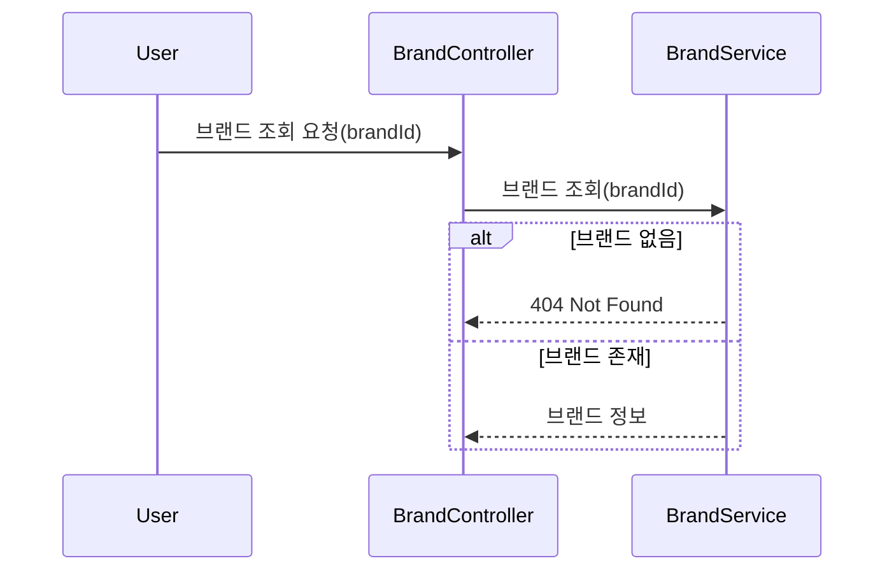
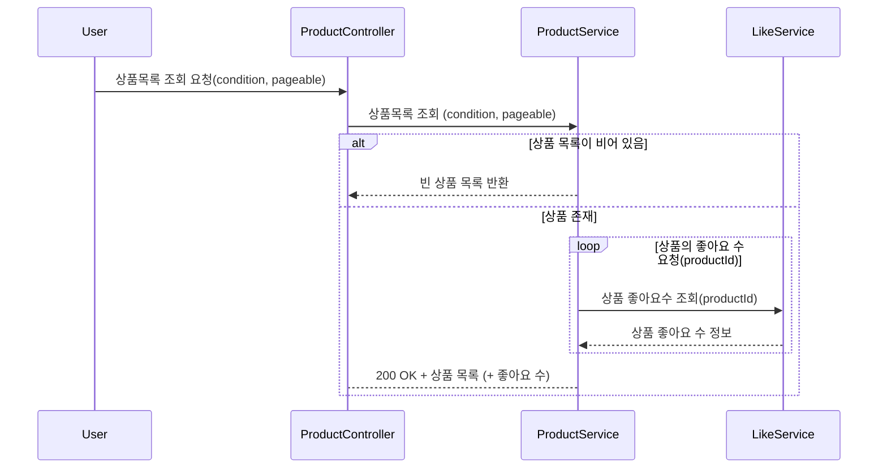
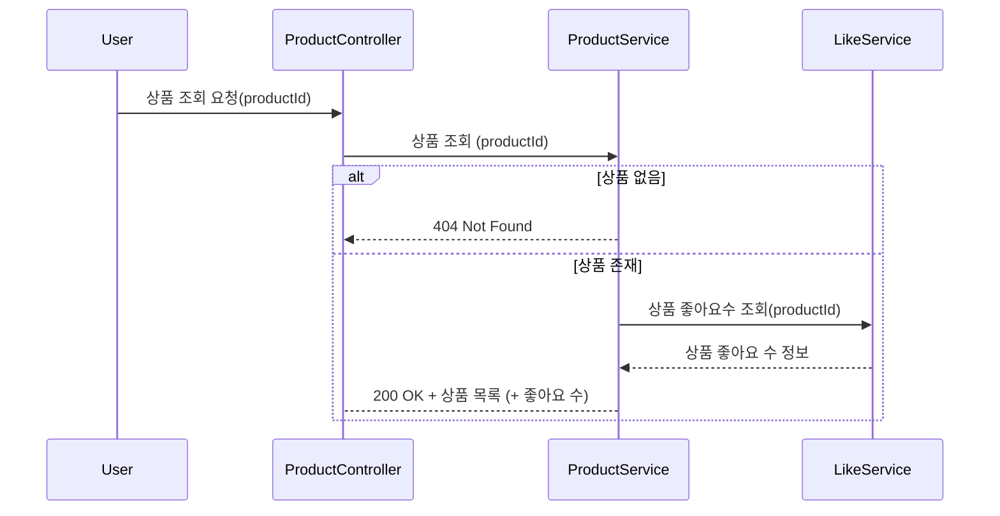

### 브랜드 조회

```mermaid 
    sequenceDiagram
    participant User
    participant BC as BrandController
    participant BS as BrandService
    
    User->>BC: 브랜드 조회 요청(brandId)
    BC->>BS: 브랜드 조회(brandId)
    alt 브랜드 없음
    BS-->>BC: 404 Not Found
    else 브랜드 존재
    BS-->>BC: 브랜드 정보
    end
```

### 상품 목록 조회

```mermaid 
    sequenceDiagram
    participant User
    participant PC as ProductController
    participant PS as ProductService
    participant LS as LikeService

    User->>PC: 상품목록 조회 요청(condition, pageable)
    PC->>PS: 상품목록 조회 (condition, pageable)
    alt 상품 목록이 비어 있음
    PS-->>PC: 빈 상품 목록 반환
    else 상품 존재
    loop 상품의 좋아요 수 요청(productId)
        PS->>LS: 상품 좋아요수 조회(productId)
        LS-->>PS: 상품 좋아요 수 정보
    end
    PS-->PC: 200 OK + 상품 목록 (+ 좋아요 수)
    end
```

### 싱품 정보 조회

```mermaid 
    sequenceDiagram
    participant User
    participant PC as ProductController
    participant PS as ProductService
    participant LS as LikeService

    User->>PC: 상품 조회 요청(productId)
    PC->>PS: 상품 조회 (productId)
    alt 상품 없음
    PS-->>PC: 404 Not Found
    else 상품 존재
    PS->>LS: 상품 좋아요수 조회(productId)
    LS-->>PS: 상품 좋아요 수 정보
    PS-->PC: 200 OK + 상품 목록 (+ 좋아요 수)
    end
```