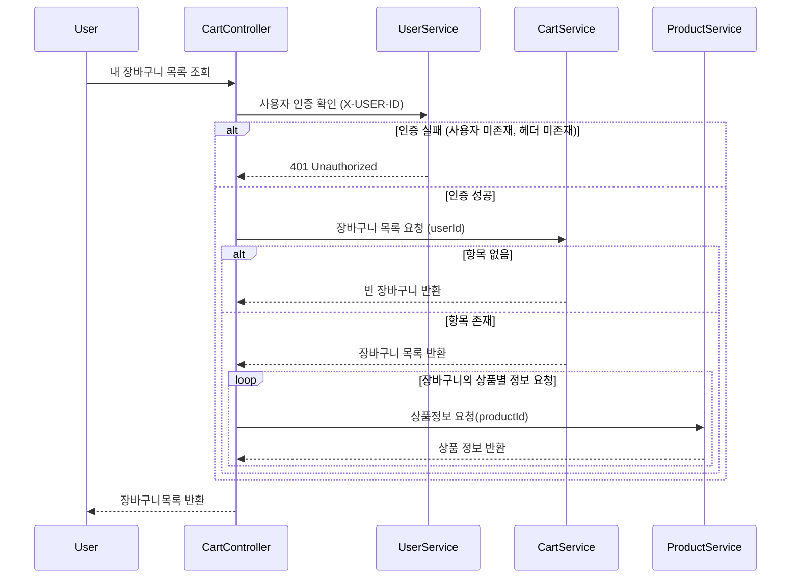
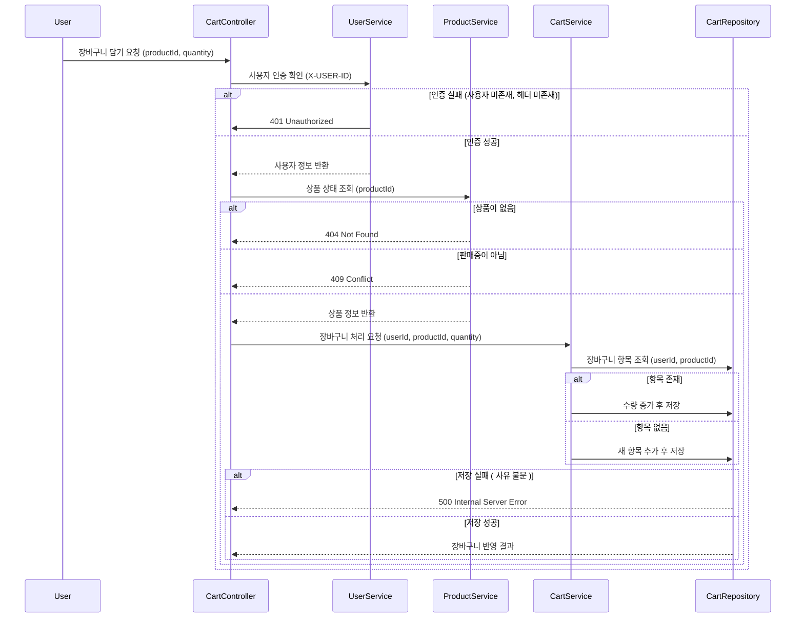
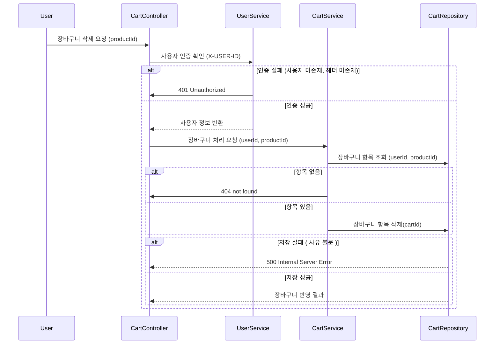

### 장바구니 조회

```mermaid 
    sequenceDiagram
    participant U as User
    participant CC as CartController
    participant US as UserService
    participant CS as CartService
    participant PS as ProductService

    U ->> CC: 내 장바구니 목록 조회 
    CC ->> US: 사용자 인증 확인 (X-USER-ID)
    alt 인증 실패 (사용자 미존재, 헤더 미존재)
        US -->> CC: 401 Unauthorized
    else 인증 성공
        CC ->> CS: 장바구니 목록 요청 (userId)
        alt 항목 없음
            CS -->> CC: 빈 장바구니 반환
        else 항목 존재
            CS -->> CC: 장바구니 목록 반환
            loop 장바구니의 상품별 정보 요청
                CC->>PS: 상품정보 요청(productId)
                PS-->>CC: 상품 정보 반환
            end
        end
    end
    CC -->> U : 장바구니목록 반환
```

### 장바구니 넣기(수량변경 포함)

```mermaid 
    sequenceDiagram
    participant U as User
    participant CC as CartController
    participant US as UserService
    participant PS as ProductService
    participant CS as CartService
    participant CR as CartRepository

    U ->> CC: 장바구니 담기 요청 (productId, quantity)
    CC ->> US: 사용자 인증 확인 (X-USER-ID)
    alt 인증 실패 (사용자 미존재, 헤더 미존재)
        US ->> CC: 401 Unauthorized
    else 인증 성공
        US -->> CC: 사용자 정보 반환
        CC ->> PS: 상품 상태 조회 (productId)
        alt 상품이 없음
            PS -->> CC: 404 Not Found
        else 판매중이 아님
            PS -->> CC: 409 Conflict
        else
            PS -->> CC: 상품 정보 반환
            CC ->> CS: 장바구니 처리 요청 (userId, productId, quantity)
            CS ->> CR: 장바구니 항목 조회 (userId, productId)
            alt 항목 존재
                CS ->> CR: 수량 증가 후 저장
            else 항목 없음
                CS ->> CR: 새 항목 추가 후 저장
            end
            alt 저장 실패 ( 사유 불문 )
                CR -->> CC: 500 Internal Server Error
            else 저장 성공
                CR -->> CC: 장바구니 반영 결과
            end
        end
    end
```

### 장바구니 삭제

```mermaid 
    sequenceDiagram
    participant U as User
    participant CC as CartController
    participant US as UserService
    participant CS as CartService
    participant CR as CartRepository

        U ->> CC: 장바구니 삭제 요청 (productId)
        CC ->> US: 사용자 인증 확인 (X-USER-ID)
        alt 인증 실패 (사용자 미존재, 헤더 미존재)
            US ->> CC: 401 Unauthorized
        else 인증 성공
            US -->> CC: 사용자 정보 반환
            CC ->> CS: 장바구니 처리 요청 (userId, productId)
            CS ->> CR: 장바구니 항목 조회 (userId, productId)
            alt 항목 없음
                CS ->> CC: 404 not found
            else 항목 있음
                CS ->> CR: 장바구니 항목 삭제(cartId)
            end
            alt 저장 실패 ( 사유 불문 )
                CR -->> CC: 500 Internal Server Error
            else 저장 성공
                CR -->> CC: 장바구니 반영 결과
        
            end
        end
```
