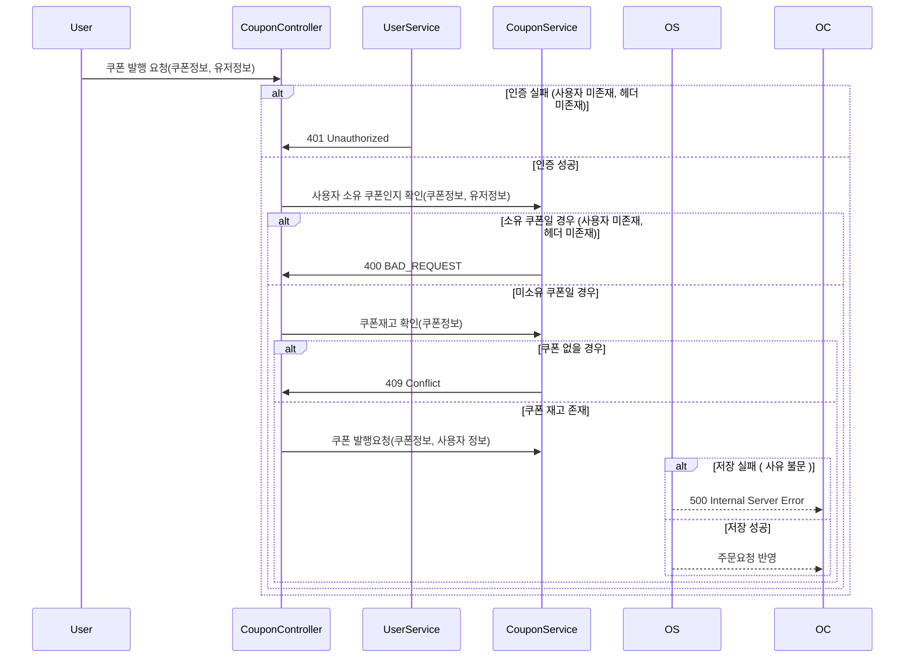

### 쿠폰발생

```mermaid
    sequenceDiagram
        participant U as User
        participant CC as CouponController
        participant US as UserService
        participant CS as CouponService
        
        
        U ->>  CC : 쿠폰 발행 요청(쿠폰정보, 유저정보)
        alt 인증 실패 (사용자 미존재, 헤더 미존재)
            US ->> CC: 401 Unauthorized 
        else 인증 성공
            CC ->> CS : 사용자 소유 쿠폰인지 확인(쿠폰정보, 유저정보)
            alt 소유 쿠폰일 경우 (사용자 미존재, 헤더 미존재)
                CS ->> CC: 400 BAD_REQUEST
            else 미소유 쿠폰일 경우
                CC ->> CS : 쿠폰재고 확인(쿠폰정보)
                alt 쿠폰 없을 경우
                CS ->> CC: 409 Conflict
                else 쿠폰 재고 존재 
                CC ->> CS : 쿠폰 발행요청(쿠폰정보, 사용자 정보)
                    alt 저장 실패 ( 사유 불문 )
                    OS -->> OC: 500 Internal Server Error
                    else 저장 성공
                    OS -->> OC: 주문요청 반영
                    end
                end
            end
        end
```