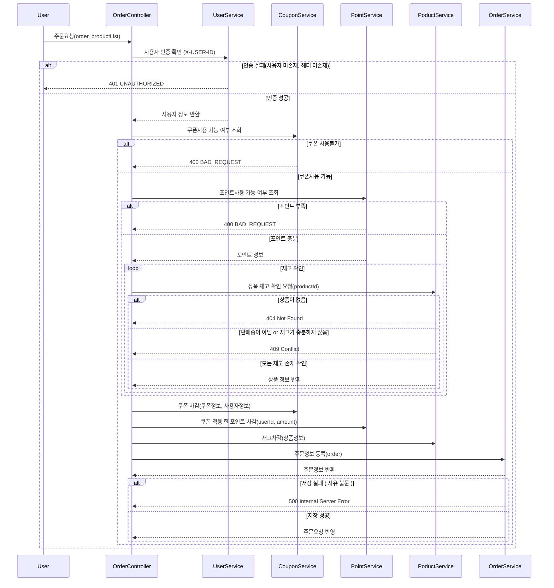
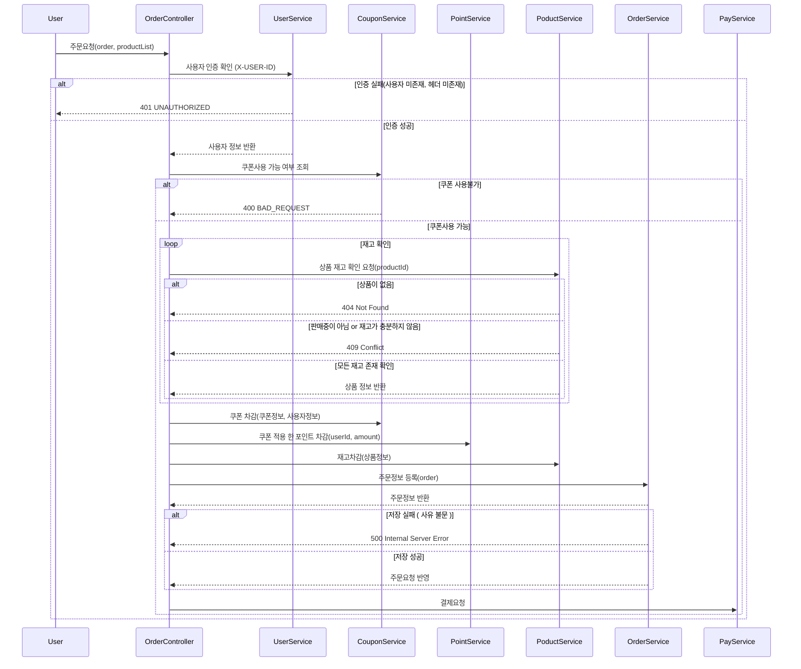
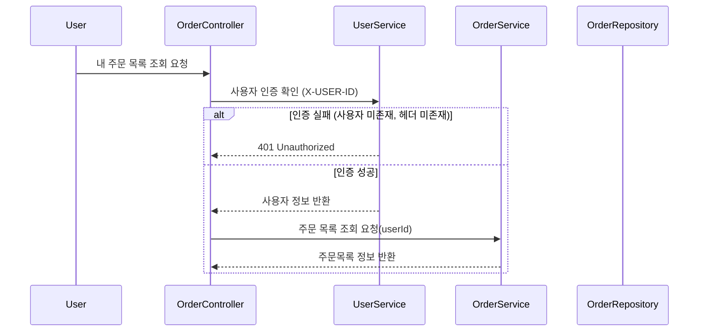
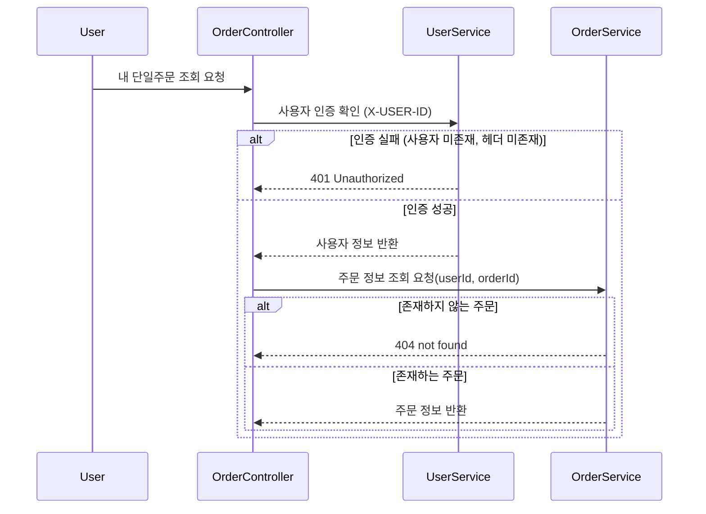

### 주문 요청

```mermaid 
    sequenceDiagram
    participant User
    participant OC as OrderController
    participant US as UserService
    participant CS as CouponService
    participant PS as PointService
    participant PTS as PoductService
    participant OS as OrderService
    
  
    
    User->>OC: 주문요청(order, productList)   
    OC->>US : 사용자 인증 확인 (X-USER-ID)
    alt 인증 실패(사용자 미존재, 헤더 미존재)
        US-->>User: 401 UNAUTHORIZED
    else 인증 성공
        US-->>OC: 사용자 정보 반환
        OC ->> CS : 쿠폰사용 가능 여부 조회
        alt 쿠폰 사용불가
            CS-->>OC : 400 BAD_REQUEST
        else 쿠폰사용 가능
            OC->>PS: 포인트사용 가능 여부 조회
            alt 포인트 부족
                PS-->>OC : 400 BAD_REQUEST
            else 포인트 충분
                PS-->>OC : 포인트 정보
                loop 재고 확인
                OC->> PTS: 상품 재고 확인 요청(productId)
                alt 상품이 없음
                    PTS -->> OC: 404 Not Found
                else 판매중이 아님 or 재고가 충분하지 않음
                    PTS -->> OC: 409 Conflict
                else 모든 재고 존재 확인
                    PTS -->> OC: 상품 정보 반환
                end
                end
                end
                OC ->> CS : 쿠폰 차감(쿠폰정보, 사용자정보)
                OC ->> PS : 쿠폰 적용 한 포인트 차감(userId, amount)
                OC ->> PTS : 재고차감(상품정보)
                OC ->> OS : 주문정보 등록(order)
                OS -->> OC : 주문정보 반환
            alt 저장 실패 ( 사유 불문 )
                OS -->> OC: 500 Internal Server Error
            else 저장 성공
                OS -->> OC: 주문요청 반영
            end
            
        end 
    end
```

### 주문 요청(PG결제 도입)

```mermaid 
    sequenceDiagram
    participant User
    participant OC as OrderController
    participant US as UserService
    participant CS as CouponService
    participant PS as PointService
    participant PTS as PoductService
    participant OS as OrderService
    participant PAS as PayService
    
  
    
    User->>OC: 주문요청(order, productList)   
    OC->>US : 사용자 인증 확인 (X-USER-ID)
    alt 인증 실패(사용자 미존재, 헤더 미존재)
        US-->>User: 401 UNAUTHORIZED
    else 인증 성공
        US-->>OC: 사용자 정보 반환
        OC ->> CS : 쿠폰사용 가능 여부 조회
        alt 쿠폰 사용불가
            CS-->>OC : 400 BAD_REQUEST
        else 쿠폰사용 가능
            loop 재고 확인
            OC->> PTS: 상품 재고 확인 요청(productId)
            alt 상품이 없음
                PTS -->> OC: 404 Not Found
            else 판매중이 아님 or 재고가 충분하지 않음
                PTS -->> OC: 409 Conflict
            else 모든 재고 존재 확인
                PTS -->> OC: 상품 정보 반환
            end
            end
            OC ->> CS : 쿠폰 차감(쿠폰정보, 사용자정보)
            OC ->> PS : 쿠폰 적용 한 포인트 차감(userId, amount)
            OC ->> PTS : 재고차감(상품정보)
            OC ->> OS : 주문정보 등록(order)
            OS -->> OC : 주문정보 반환
        alt 저장 실패 ( 사유 불문 )
            OS -->> OC: 500 Internal Server Error
        else 저장 성공
            OS -->> OC: 주문요청 반영
        end
            OC ->> PAS : 결제요청
        end 
    end
```

### 유저의 주문 목록 조회

```mermaid 
    sequenceDiagram
    participant User
    participant OC as OrderController
    participant US as UserService
    participant OS as OrderService
    participant OR as OrderRepository
    
    User->>OC: 내 주문 목록 조회 요청
    OC ->> US: 사용자 인증 확인 (X-USER-ID)
    alt 인증 실패 (사용자 미존재, 헤더 미존재)
        US -->> OC: 401 Unauthorized
    else 인증 성공
        US -->> OC: 사용자 정보 반환
        OC ->> OS: 주문 목록 조회 요청(userId)
        OS -->> OC : 주문목록 정보 반환
    end
```

### 단일 주문 상세 조회

```mermaid 
     sequenceDiagram
    participant User
    participant OC as OrderController
    participant US as UserService
    participant OS as OrderService
    
    User->>OC: 내 단일주문 조회 요청
    OC ->> US: 사용자 인증 확인 (X-USER-ID)
    alt 인증 실패 (사용자 미존재, 헤더 미존재)
        US -->> OC: 401 Unauthorized
    else 인증 성공
        US -->> OC: 사용자 정보 반환
        OC ->> OS: 주문 정보 조회 요청(userId, orderId)
        alt 존재하지 않는 주문
            OS -->> OC : 404 not found
        else 존재하는 주문
            OS -->> OC : 주문 정보 반환
        end
    end

```