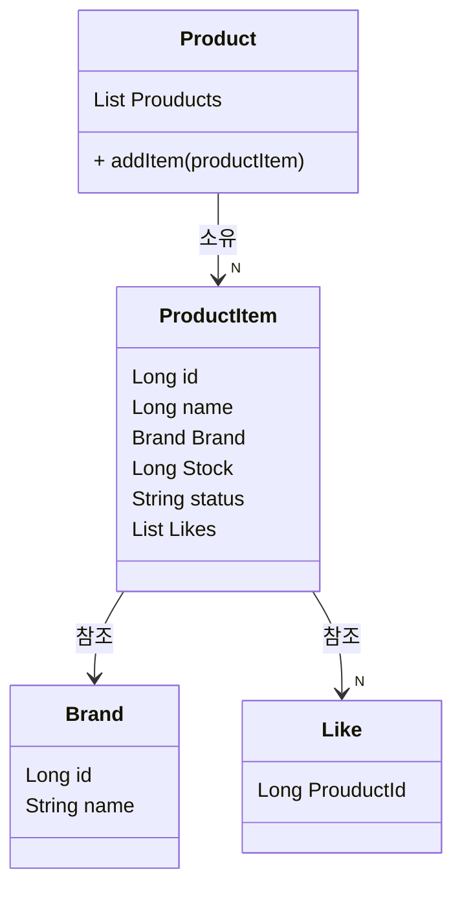

```mermaid 
classDiagram
    class Brand{
    Long id
    String name
    }
    class Product{
    List Prouducts
    + addItem(productItem)
    }
    class ProductItem{
    Long id
    Long name
    Brand Brand
    Long Stock
    String status
    List Likes 
    }

    class Like{
    Long ProuductId
    }
    
    Product --> "N" ProductItem :소유
    ProductItem --> Brand : 참조
    ProductItem --> "N" Like : 참조
```
