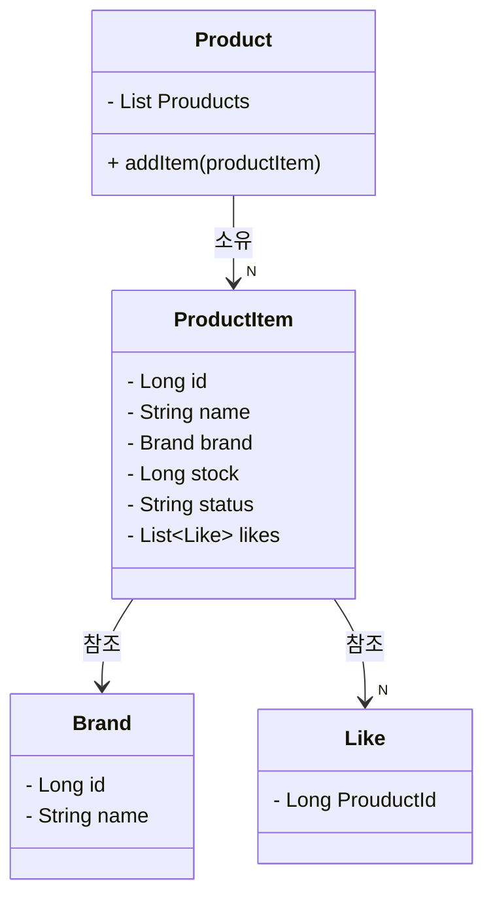

```mermaid 
classDiagram
    class Brand{
        - Long id
        - String name
    }
    class Product{
        - List Prouducts
        + addItem(productItem)
    }
    class ProductItem {
        - Long id
        - String name
        - Brand brand
        - Long stock
        - String status
        - List~Like~ likes
    }

    class Like{
        - Long ProuductId
    }
    
    Product --> "N" ProductItem :소유
    ProductItem --> Brand : 참조
    ProductItem --> "N" Like : 참조
```
