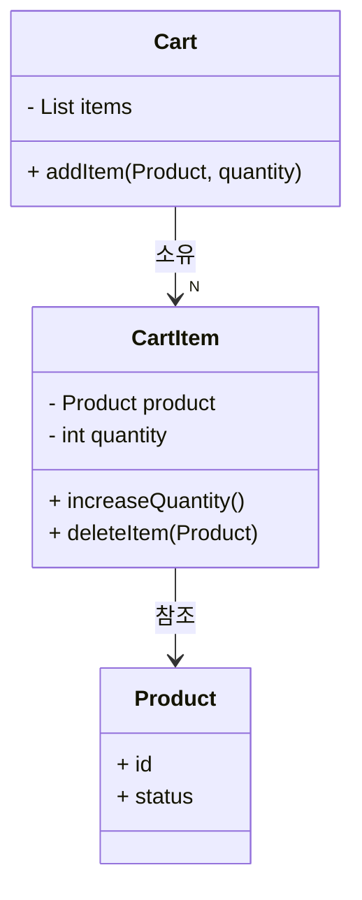

```mermaid 
classDiagram
  class Cart{
  - List<CartItem> items
    + addItem(Product, quantity)
  
  }
  class CartItem{
  - Product product
    - int quantity
  
            + increaseQuantity()
            + deleteItem(Product)
      }
      class Product {
        + id
        + status
          }
  
      Cart --> "N" CartItem : 소유
      CartItem --> Product : 참조
```
