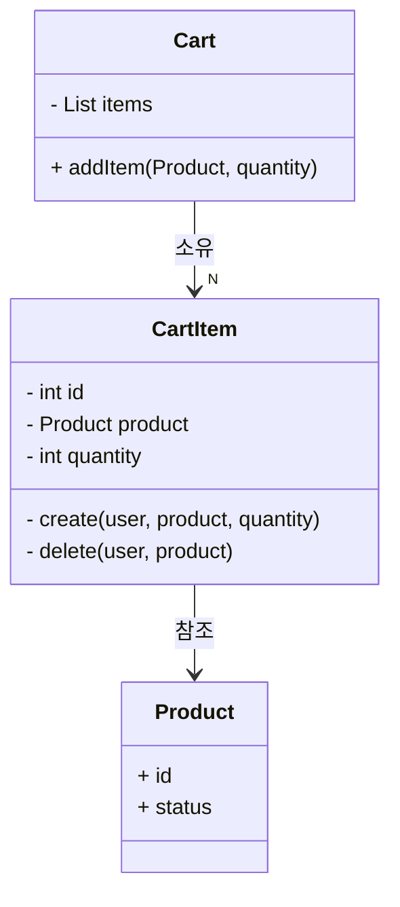

```mermaid 
    classDiagram
    class Cart{
    - List<CartItem> items
    + addItem(Product, quantity)
    
    }
    class CartItem{
        - int id
        - Product product
        - int quantity
        - create(user, product, quantity)
        - delete(user, product)
    
    }
    class Product {
    + id
    + status
    }
    
    Cart --> "N" CartItem : 소유
    CartItem --> Product : 참조
```
