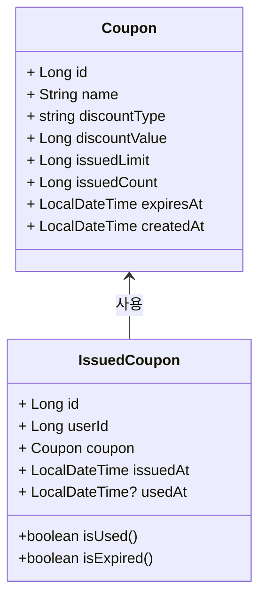

```mermaid 
classDiagram
    class Coupon {
        + Long id
        + String name
        + string discountType
        + Long discountValue
        + Long issuedLimit
        + Long issuedCount
        + LocalDateTime expiresAt
        + LocalDateTime createdAt
    }

    class IssuedCoupon {
        + Long id
        + Long userId
        + Coupon coupon
        + LocalDateTime issuedAt
        + LocalDateTime? usedAt

        +boolean isUsed()
        +boolean isExpired()
    }

    Coupon <-- IssuedCoupon : 사용


```
