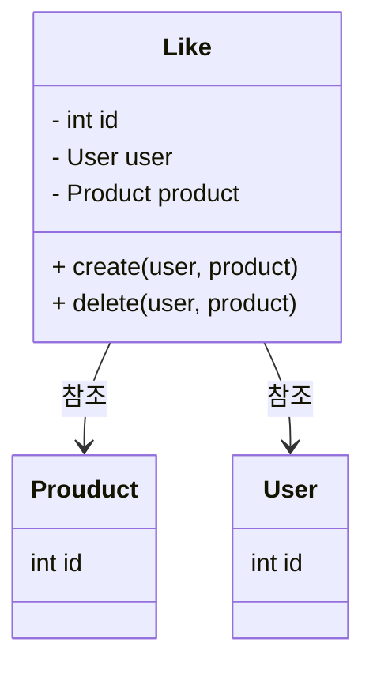
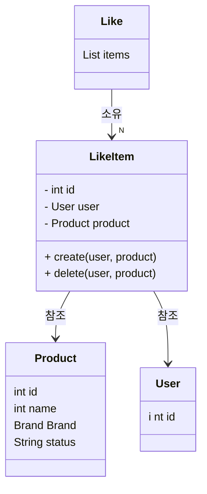

### 좋아요 등록/취소

```mermaid 
    classDiagram
    class Prouduct{
     int id
    }
    class User{
        int id
    }
    class Like{
        - int id
        - User user
        - Product product
        + create(user, product)
        + delete(user, product)
    }
    
        Like --> Prouduct : 참조
        Like --> User : 참조
```

### 내가 좋아요 한 상품 목록 조회

```mermaid 
    classDiagram
    class Like{
      List<LikeItem> items
    }
    class Product{
        int id
        int name
        Brand Brand
        String status
    }
    class LikeItem{
        - int id
        - User user
        - Product product
        + create(user, product)
        + delete(user, product)
    }
    class User {
    i   nt id
    }

    Like --> "N" LikeItem :소유
    LikeItem --> Product : 참조
    LikeItem --> User : 참조
```