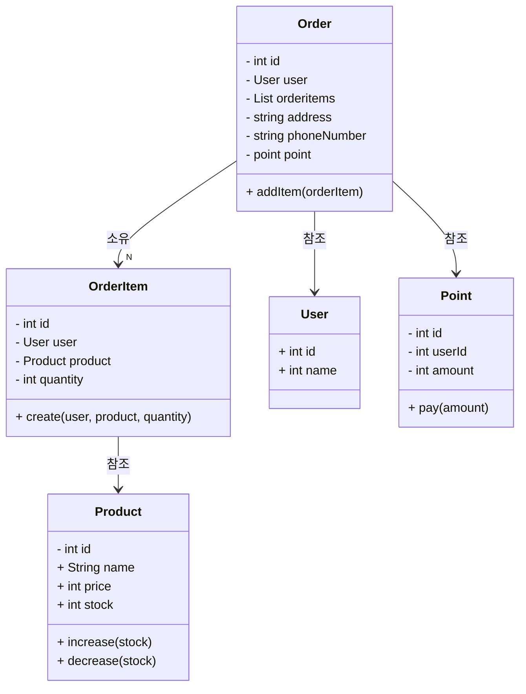

### 

```mermaid 
    classDiagram
    class Order{
    - int id
      - User user
      - List orderitems
      - string address
      - string phoneNumber
      - point point
    
   + addItem(orderItem)
  }
  class OrderItem{
      - int id
      - User user
      - Product product
      - int quantity
      + create(user, product, quantity)
  }
  class Product{
      - int id
      + String name
      + int price
      + int stock
      + increase(stock)
      + decrease(stock)
  }
  class User {
      + int id
      + int name
  }
  class Point{
      - int id
      - int userId
      - int amount

      + pay(amount)
  }

  Order --> "N" OrderItem :소유
  OrderItem --> Product : 참조
  Order --> User : 참조
  Order --> Point : 참조
```