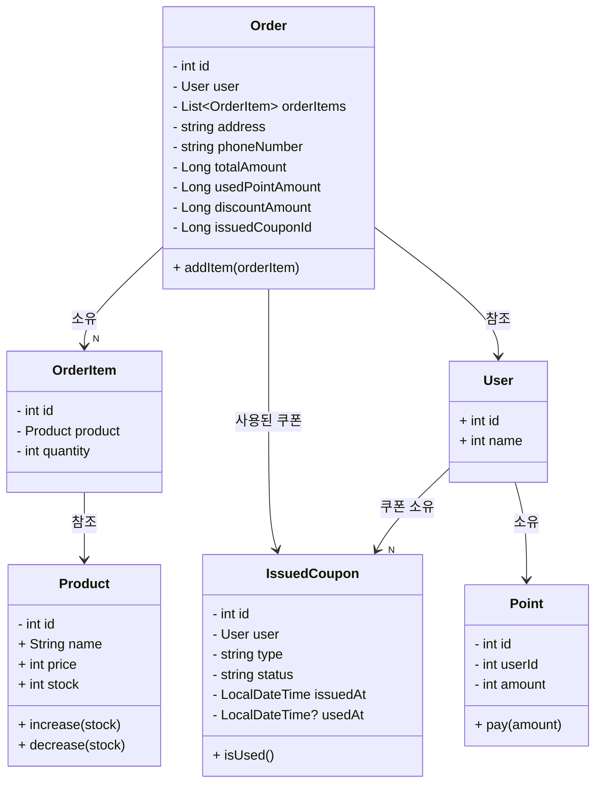

### 

```mermaid 
    classDiagram
    class Order{
    - int id
    - User user
    - List~OrderItem~ orderItems
    - string address
    - string phoneNumber
    - Long totalAmount
    - Long usedPointAmount
    - Long discountAmount
    - Long issuedCouponId
    
   + addItem(orderItem)
  }
  class OrderItem{
      - int id
      - Product product
      - int quantity
  }
  class Product{
      - int id
      + String name
      + int price
      + int stock
      + increase(stock)
      + decrease(stock)
  }
  class User {
      + int id
      + int name
  }
  class Point{
      - int id
      - int userId
      - int amount

      + pay(amount)
  }

  class IssuedCoupon { 
      - int id
      - User user
      - string type
      - string status
      - LocalDateTime issuedAt
      - LocalDateTime? usedAt
      + isUsed() 
  }

    Order --> "N" OrderItem : 소유
    OrderItem --> Product : 참조
    Order --> User : 참조
    Order --> IssuedCoupon : 사용된 쿠폰
    User --> "N" IssuedCoupon : 쿠폰 소유
    User --> Point : 소유
```