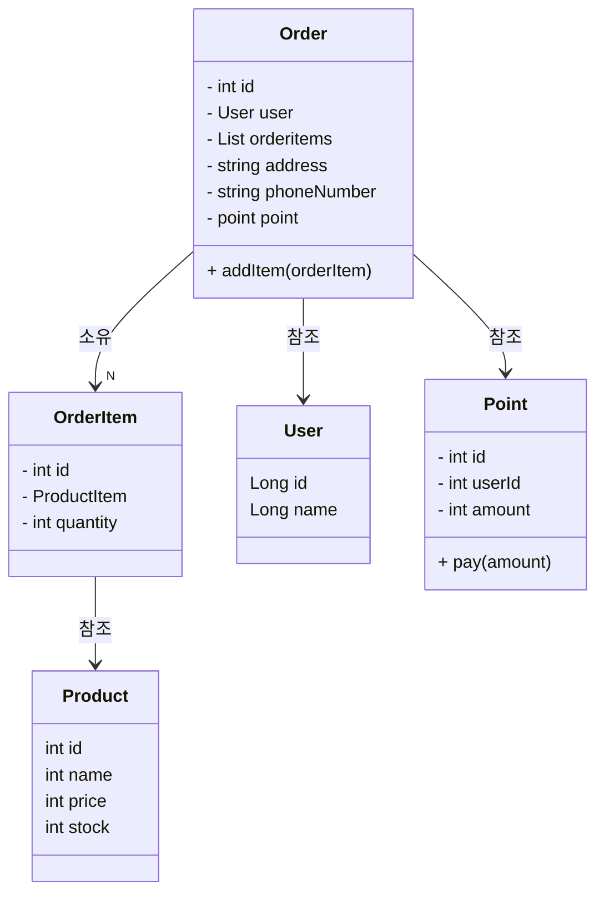

### 

```mermaid 
    classDiagram
    class Order{
    - int id
      - User user
      - List orderitems
      - string address
      - string phoneNumber
      - point point
    
           + addItem(orderItem)
          }
          class OrderItem{
           - int id
           - ProductItem
           - int quantity
          }
          class Product{
           int id
           int name
           int price
           int stock
          }
          class User {
              Long id
              Long name
          }
          class Point{
              - int id
              - int userId
              - int amount
    
              + pay(amount)
          }
        
          Order --> "N" OrderItem :소유
          OrderItem --> Product : 참조
          Order --> User : 참조
          Order --> Point : 참조
```