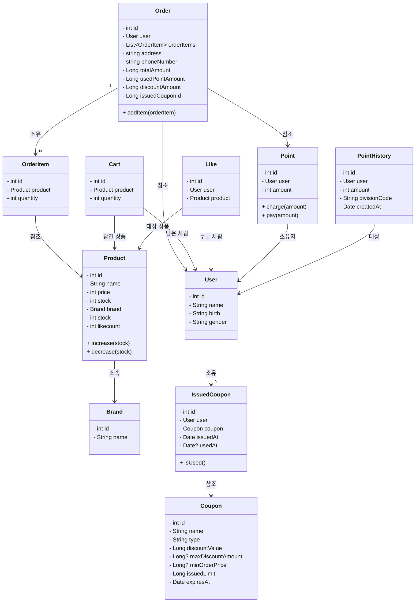

### 전체 클래스 다이어그램

```mermaid 

    classDiagram
    class User {
    - int id
      - String name
      - String birth
      - String gender
      }
    
    class Product {
    - int id
      - String name
      - int price
      - int stock
      - Brand brand
      - int stock
      - int likecount
      + increase(stock)
      + decrease(stock)
      }
    
    class Brand { 
     - int id
     - String name 
    }

    class Order{
     - int id
     - User user
     - List~OrderItem~ orderItems
     - string address
     - string phoneNumber
     - Long totalAmount
     - Long usedPointAmount
     - Long discountAmount
     - Long issuedCouponId

     + addItem(orderItem)
     }
    class OrderItem {
    - int id
    - Product product
    - int quantity
    }
    
    class Cart {
     - int id
     - Product product
     - int quantity
    
    }
    
    class Like {
     - int id
     - User user
     - Product product 
     }

    class Point {
        - int id
        - User user
        - int amount
        + charge(amount)
        + pay(amount)
    }

    class PointHistory {
        - int id
        - User user
        - int amount
        - String divisionCode
        - Date createdAt
    }


    class Coupon {
        - int id
        - String name
        - String type
        - Long discountValue
        - Long? maxDiscountAmount
        - Long? minOrderPrice
        - Long issuedLimit
        - Date expiresAt
    }

    class IssuedCoupon {
        - int id
        - User user
        - Coupon coupon
        - Date issuedAt
        - Date? usedAt
        + isUsed() 
    }

    
    Order "1" --> "N" OrderItem : 소유
    OrderItem --> Product : 참조
    Order --> User : 참조
    Order --> Point : 참조
    Product --> Brand : 소속
    Cart --> User : 담은 사람
    Cart --> Product : 담긴 상품
    Like --> User : 누른 사람
    Like --> Product : 대상 상품
    Point --> User : 소유자
    PointHistory --> User : 대상
    User --> "N" IssuedCoupon : 소유
    IssuedCoupon --> Coupon : 참조
    
```