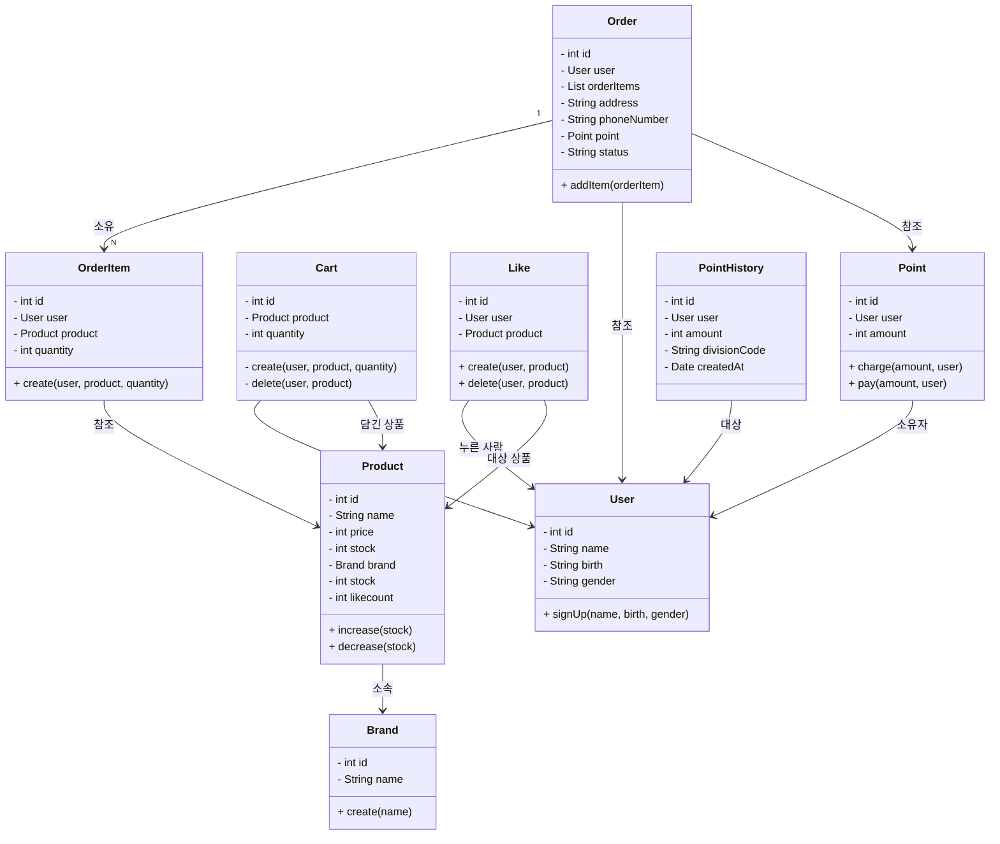

### 전체 클래스 다이어그램

```mermaid 

    classDiagram
    class User {
    - int id
      - String name
      - String birth
      - String gender
      + signUp(name, birth, gender)
      }
    
    class Product {
    - int id
      - String name
      - int price
      - int stock
      - Brand brand
      - int stock
      - int likecount
      + increase(stock)
      + decrease(stock)
      }
    
    class Brand {
    - int id
      - String name
      + create(name)
      }
    
    class Order {
    - int id
      - User user
      - List<OrderItem> orderItems
      - String address
      - String phoneNumber
      - Point point
      - String status
      + addItem(orderItem)
      }
    
    class OrderItem {
    - int id
      - User user
      - Product product
      - int quantity
      + create(user, product, quantity)
      }
    
    class Cart {
    - int id
      - Product product
      - int quantity
      - create(user, product, quantity)
      - delete(user, product)
    
    }
    
    class Like {
    - int id
      - User user
      - Product product
      + create(user, product)
      + delete(user, product)
      }
    
    class Point {
    - int id
      - User user
      - int amount
      + charge(amount, user)
      + pay(amount, user)
      }
    
    class PointHistory {
    - int id
      - User user
      - int amount
      - String divisionCode
      - Date createdAt
      }

    
    Order "1" --> "N" OrderItem : 소유
    OrderItem --> Product : 참조
    Order --> User : 참조
    Order --> Point : 참조
    Product --> Brand : 소속
    Cart --> User : 담은 사람
    Cart --> Product : 담긴 상품
    Like --> User : 누른 사람
    Like --> Product : 대상 상품
    Point --> User : 소유자
    PointHistory --> User : 대상
    
```