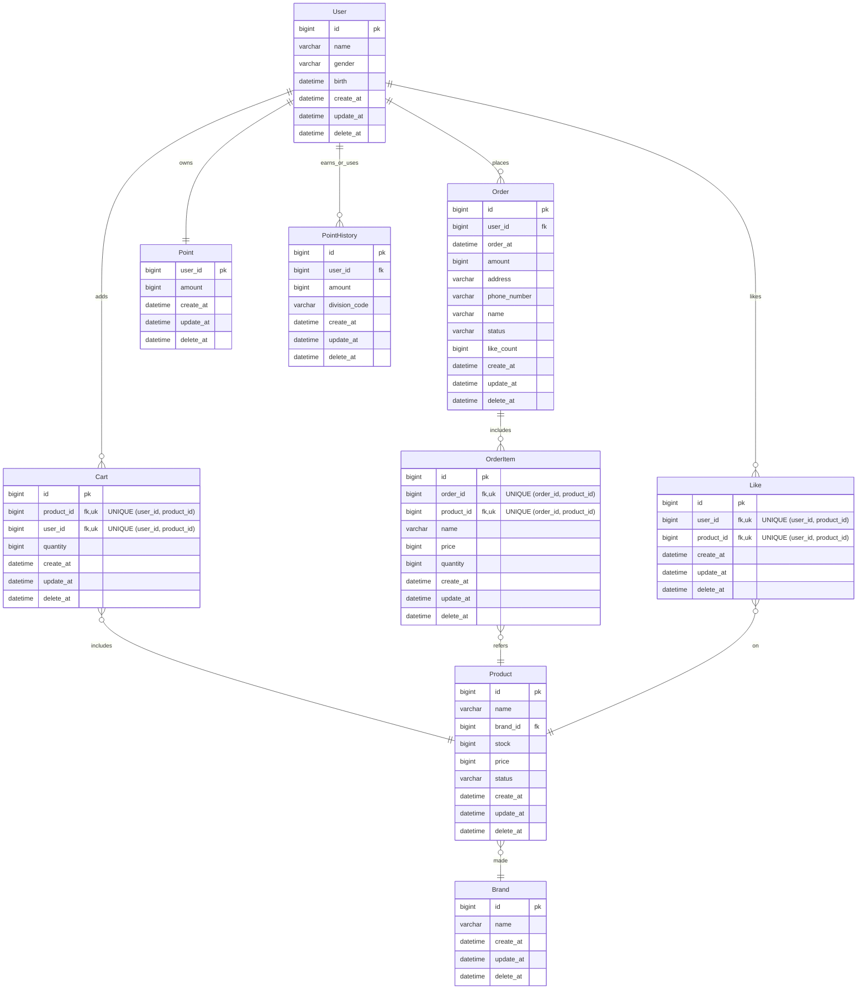

### ERD

### 코드값 관리(예상)
##### - Order 의 status  : [paid, preparing, shipped, delivered, cancelled,refunded ]
##### - PointHistory 의 division_code :[pay, add]
##### - Product 의 status : [available, outOfStock, discontinued, hidden]